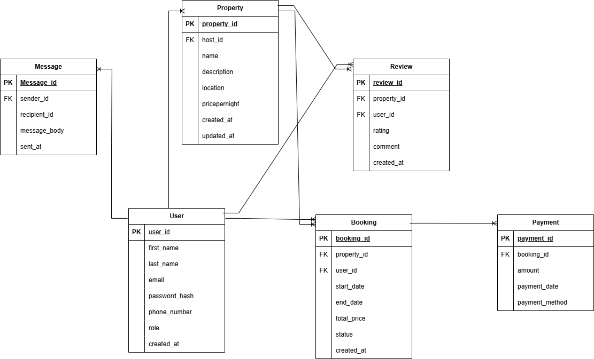

## User
- **user_id**: Primary Key, UUID, Indexed
- **first_name**: VARCHAR, NOT NULL
- **last_name**: VARCHAR, NOT NULL
- **email**: VARCHAR, UNIQUE, NOT NULL
- **password_hash**: VARCHAR, NOT NULL
- **phone_number**: VARCHAR, NULL
- **role**: ENUM (guest, host, admin), NOT NULL
- **created_at**: TIMESTAMP, DEFAULT CURRENT_TIMESTAMP

---

## Property
- **property_id**: Primary Key, UUID, Indexed
- **host_id**: Foreign Key → User(user_id)
- **name**: VARCHAR, NOT NULL
- **description**: TEXT, NOT NULL
- **location**: VARCHAR, NOT NULL
- **pricepernight**: DECIMAL, NOT NULL
- **created_at**: TIMESTAMP, DEFAULT CURRENT_TIMESTAMP
- **updated_at**: TIMESTAMP, ON UPDATE CURRENT_TIMESTAMP

---

## Booking
- **booking_id**: Primary Key, UUID, Indexed
- **property_id**: Foreign Key → Property(property_id)
- **user_id**: Foreign Key → User(user_id)
- **start_date**: DATE, NOT NULL
- **end_date**: DATE, NOT NULL
- **total_price**: DECIMAL, NOT NULL
- **status**: ENUM (pending, confirmed, canceled), NOT NULL
- **created_at**: TIMESTAMP, DEFAULT CURRENT_TIMESTAMP

---

## Payment
- **payment_id**: Primary Key, UUID, Indexed
- **booking_id**: Foreign Key → Booking(booking_id)
- **amount**: DECIMAL, NOT NULL
- **payment_date**: TIMESTAMP, DEFAULT CURRENT_TIMESTAMP
- **payment_method**: ENUM (credit_card, paypal, stripe), NOT NULL

---

## Review
- **review_id**: Primary Key, UUID, Indexed
- **property_id**: Foreign Key → Property(property_id)
- **user_id**: Foreign Key → User(user_id)
- **rating**: INTEGER, CHECK: rating ≥ 1 AND rating ≤ 5, NOT NULL
- **comment**: TEXT, NOT NULL
- **created_at**: TIMESTAMP, DEFAULT CURRENT_TIMESTAMP

---

## Message
- **message_id**: Primary Key, UUID, Indexed
- **sender_id**: Foreign Key → User(user_id)
- **recipient_id**: Foreign Key → User(user_id)
- **message_body**: TEXT, NOT NULL
- **sent_at**: TIMESTAMP, DEFAULT CURRENT_TIMESTAMP

---------------------------------------------------------------------------------------------------------

# 🔗 Entity Relationships (ERD)
Below is the list of relationships between the entities in the Airbnb-style database:

## Users & Properties
One User can create multiple Properties
Relationship: User (1) ────< Property (N)
Foreign Key in Property: owner_id → references User.id

## Users & Bookings

One User can make multiple Bookings
Relationship: User (1) ────< Booking (N)
Foreign Key in Booking: user_id → references User.id

## Properties & Bookings

One Property can have many Bookings
Relationship: Property (1) ────< Booking (N)
Foreign Key in Booking: property_id → references Property.id

## Properties & Reviews

One Property can have many Reviews
Relationship: Property (1) ────< Review (N)
Foreign Key in Review: property_id → references Property.id

## Users & Reviews

One User can write multiple Reviews
Relationship: User (1) ────< Review (N)
Foreign Key in Review: user_id → references User.id

--------------------------------------------------------------------------------------------------------

# Entity Relationship Diagram (ERD)

Below is the ERD for the Airbnb Database project:

